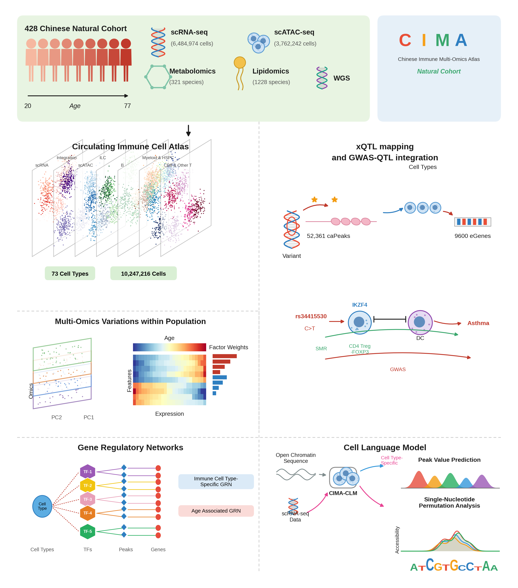
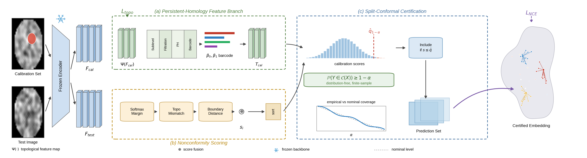

# sciglyph

**Publication-quality scientific illustration in pure matplotlib — no BioRender, no Illustrator.**

Overview figures and architecture diagrams are usually drawn by hand in a
subscription tool. That makes them pretty, but also unreproducible: you cannot
diff them, you cannot regenerate them when the numbers change, and you cannot
put them under version control.

`sciglyph` gives you the primitives to draw the same figures as **code**.

<p align="center">
  
</p>

<p align="center">
  
</p>

<sub>Both figures above are generated by the scripts in
<a href="examples/">examples/</a> — nothing was touched by hand. The content is
synthetic; swap in your own numbers and the layout carries over.</sub>

---

## Why

| | subscription tools | `sciglyph` |
|---|---|---|
| Reproducible | ✗ manual pixel-pushing | ✓ a script |
| Version control | ✗ binary blobs | ✓ diffable source |
| Data-driven | ✗ retype every number | ✓ read straight from your results |
| Vector output | ~ depends on export | ✓ PDF/SVG with editable text |
| Cost | subscription | free, MIT |

## Install

```bash
pip install sciglyph          # or: git clone && pip install -e .
```

Only `matplotlib` and `numpy`. Nothing else.

## Quick start

```python
import matplotlib.pyplot as plt
from sciglyph import bio, set_canvas, report, RC

plt.rcParams.update(RC)
fig = plt.figure(figsize=(7.2, 3.0), dpi=300)
ax = fig.add_axes([0, 0, 1, 1]); ax.set_xlim(0, 1); ax.set_ylim(0, 1); ax.axis("off")
set_canvas(fig)                      # required on non-square canvases

bio.person(ax, .08, .55, s=.30)
bio.dna(ax, .25, .55, w=.05, h=.45, n=2)
bio.cell(ax, .42, .55, r=.06, seed=1)
bio.seq_logo(ax, .60, .40, [("A", .6), ("C", .9), ("G", .4), ("T", .7)], w=.03)

report(fig, ax)                      # catch text collisions before saving
fig.savefig("figure.pdf", bbox_inches="tight")
```

Run the full examples:

```bash
python examples/overview_figure.py    # -> gallery/overview_figure.png
python examples/architecture.py       # -> gallery/architecture.png
```

## What's included

**`sciglyph.bio`** — glyphs for Nature/Science-style overview figures:
`person` (cohorts) · `dna` · `cell` · `lipid` · `metabolite` ·
`nucleosome_chain` · `umap_layer` (the stacked atlas look) ·
`seq_logo` (information-scaled letters, no logomaker needed) ·
`stacked_planes` · `rbox` · `arr`

**`sciglyph.arch`** — glyphs for architecture diagrams:
`cuboid` / `feature_stack` (3-D feature blocks) · `trapezoid` (encoders) ·
`module_stack` (`Conv|BN|ReLU` bars) · `dashed_group` (the `(a)/(b)/(c)`
language) · `flow` · `op_circle` · `snowflake` (frozen backbone) ·
`image_thumb` · `embedding_space` (contrastive panels) · `loss_tag` · `bracket`

**`sciglyph.layout`** — pre-flight collision detection.

## Catching layout bugs before you save

When a figure breaks, it is almost never the artwork — it is the layout.
`report()` uses the real rendered bounding boxes to find overlapping text, so
you do not have to hunt for it by eye:

```python
report(fig, ax)
# [sciglyph.layout] 36 text objects
#   ! 'CD4 Treg/-FOXP3' x 'SMR' overlap 92%
```

It also works from the command line on any script that exposes `fig` and `ax`:

```bash
python -m sciglyph.layout my_figure.py
```

**It only covers text-vs-text.** Text hidden *behind artwork* is invisible to
it — always look at the rendered PNG as the final step.

## Notes from actually shipping these figures

- **Call `set_canvas(fig)`.** In `[0,1]` coordinates a "circle" is `r·W` wide
  and `r·H` tall. On a 12×3 canvas, every circle becomes a rugby ball.
- **Anchor arrows to what `feature_stack` returns**, not to hard-coded
  coordinates — otherwise changing the number of blocks silently breaks them.
- **Never put symbol codepoints in figure text.** `❄` (U+2744) is missing from
  most sans fonts and renders as a tofu box. Draw it (`arch.snowflake`).
- **Overlapping translucent fills blend into one muddy colour.** Keep the fill
  under `alpha=0.15`, stroke each curve, *and* offset the peaks. Tuning alpha
  alone will not save you.
- **Fonts:** Arial/Helvetica are often absent on Linux. `RC` falls back to
  Liberation Sans (metric-compatible with Arial) and sets `pdf.fonttype=42`
  so text stays editable in the PDF — a hard requirement at most journals.
- **Don't move elements toward whitespace.** Whitespace relocates, it does not
  disappear. Decide which row an element belongs to, move it as a group, then
  verify with the quadrant ink distribution.

## Honest scope

This gets you clean flat schematics combined with data panels — the register
of a Nature/Science overview figure or a TPAMI architecture diagram. It will
**not** reproduce hand-drawn illustration (shaded organs, textured cells,
gradients). For that, embed a CC-BY asset and cite it rather than fake it.

## License

MIT © Guo Cheng
